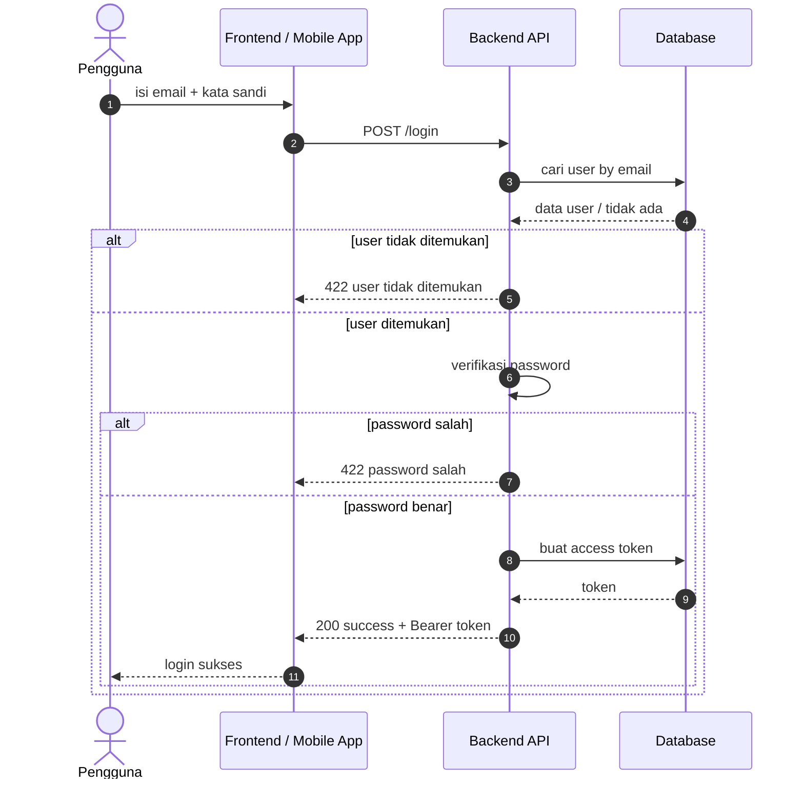
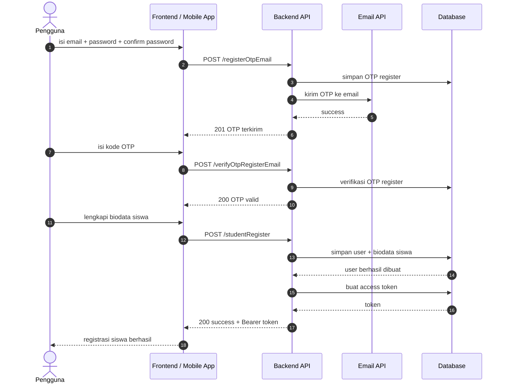
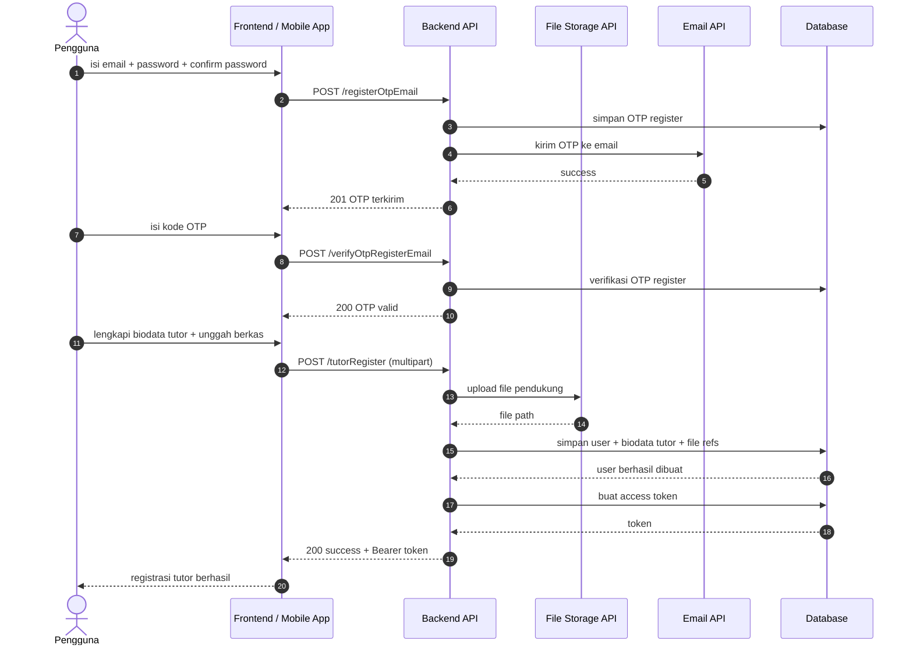
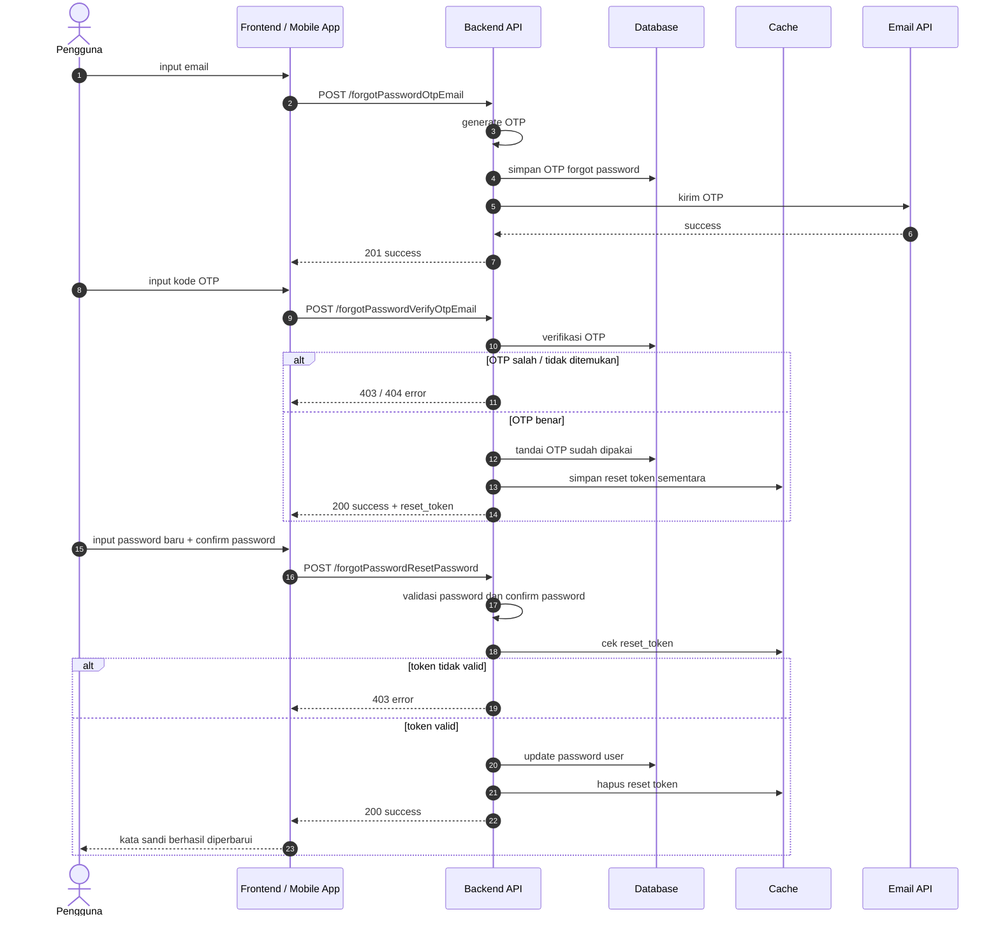
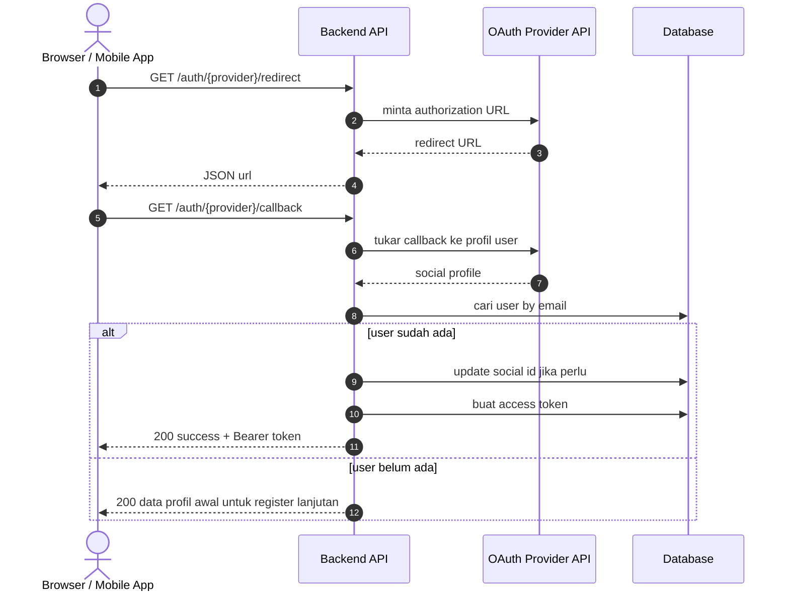
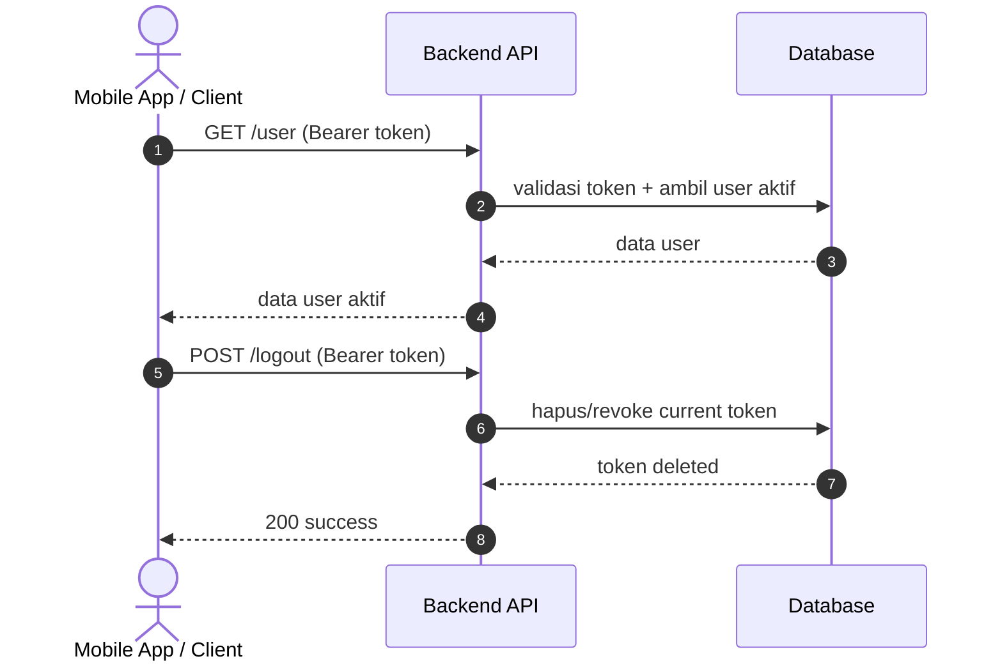

# Authentication Sequence Diagrams

Dokumen ini merangkum alur autentikasi pada level tinggi agar mudah dipahami. Diagram disederhanakan menjadi interaksi utama antara client, backend, database, dan API eksternal.

## 1. Manual Login

## 2. Register Siswa

## 3. Register Tutor

## 4. Forgot Password

## 5. OAuth Social Login

## 6. Ambil User Aktif dan Logout

## Catatan

- Endpoint yang dilindungi Sanctum berada di grup `auth:sanctum` pada [routes/api.php](../../routes/api.php).
- Flow OTP di level tinggi ditampilkan sebagai interaksi Backend, Database, Cache, dan Email API.
- Flow OAuth di level tinggi ditampilkan sebagai interaksi Backend dengan OAuth Provider API dan Database.
