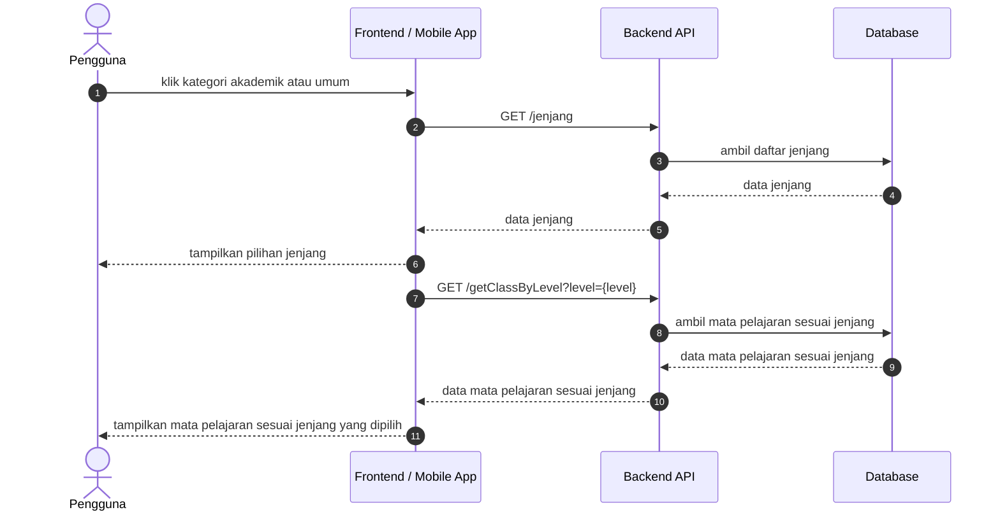
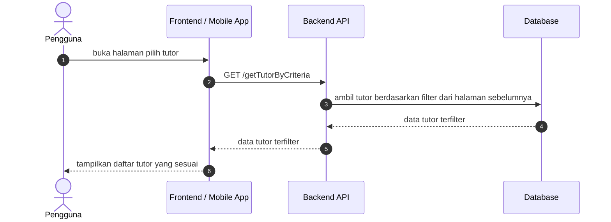
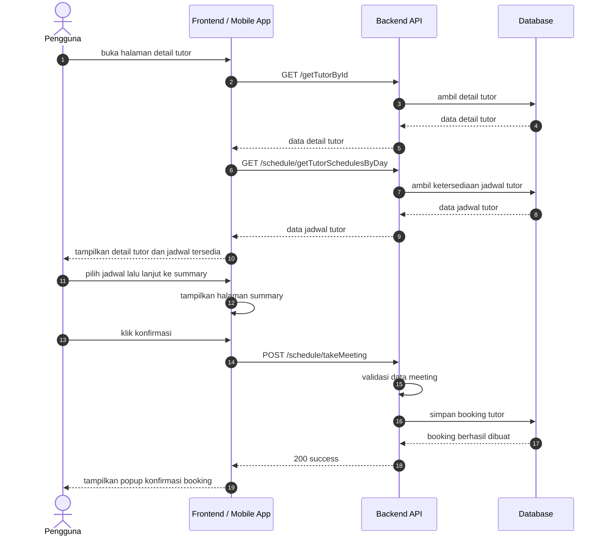

# Book Tutor Sequence Diagrams

Dokumen ini merangkum alur pemilihan tutor pada level tinggi agar mudah dipahami. Diagram disederhanakan menjadi interaksi utama antara client, backend, dan database.

## 1. Filter Page

## 2. Pilih Tutor Page

## 3. Detail Tutor Page

## Catatan

- Filter page menggunakan endpoint [GET /jenjang](../../routes/api.php) dan [GET /getClassByLevel](../../routes/api.php).
- Pilih tutor page menggunakan endpoint [GET /getTutorByCriteria](../../routes/api.php) untuk mengambil tutor yang sudah difilter.
- Detail tutor page menggunakan endpoint [GET /getTutorById](../../routes/api.php), [GET /schedule/getTutorSchedulesByDay](../../routes/api.php), dan [POST /schedule/takeMeeting](../../routes/api.php).
