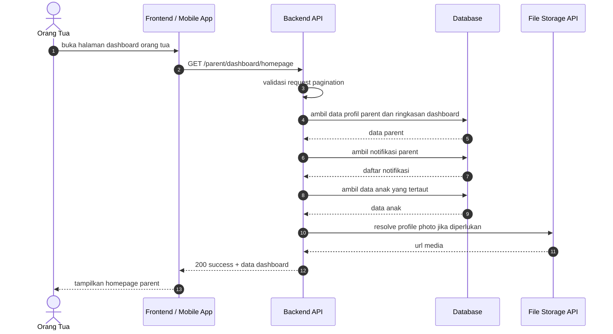
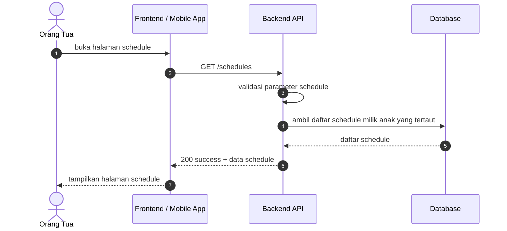
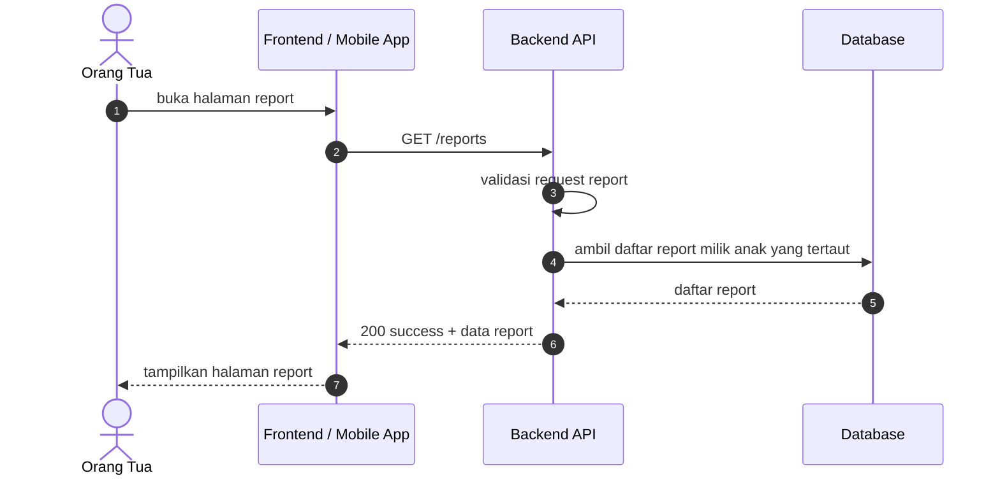
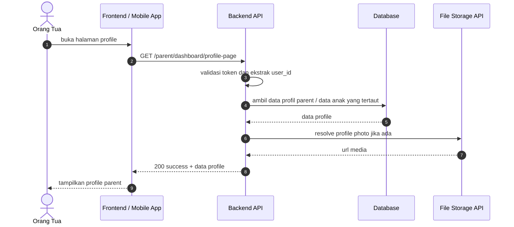

# Parent Dashboard Sequence Diagrams

Dokumen ini merangkum alur dashboard untuk kategori parent pada level tinggi agar mudah dipahami. Diagram disederhanakan menjadi interaksi utama antara client, backend, database, dan storage.

## 1. Home Page

## 2. Schedule Page

## 3. Report Page

## 4. Profile Page

## Catatan

- Endpoint home page parent berada di grup `role:parent` pada [routes/api.php](../../routes/api.php).
- Endpoint schedule parent berada di grup `auth:sanctum` pada [routes/api.php](../../routes/api.php).
- Endpoint report parent berada di grup `auth:sanctum` pada [routes/api.php](../../routes/api.php).
- Endpoint profile parent berada di grup `role:parent` pada [routes/api.php](../../routes/api.php).
- Flow homepage menampilkan profil parent, notifikasi, data anak yang tertaut, dan media profil jika ada.
- Flow schedule menampilkan daftar jadwal milik anak yang tertaut.
- Flow report menampilkan daftar report milik anak yang tertaut.
- Flow profile menampilkan data profil parent dan informasi yang relevan jika tersedia.
