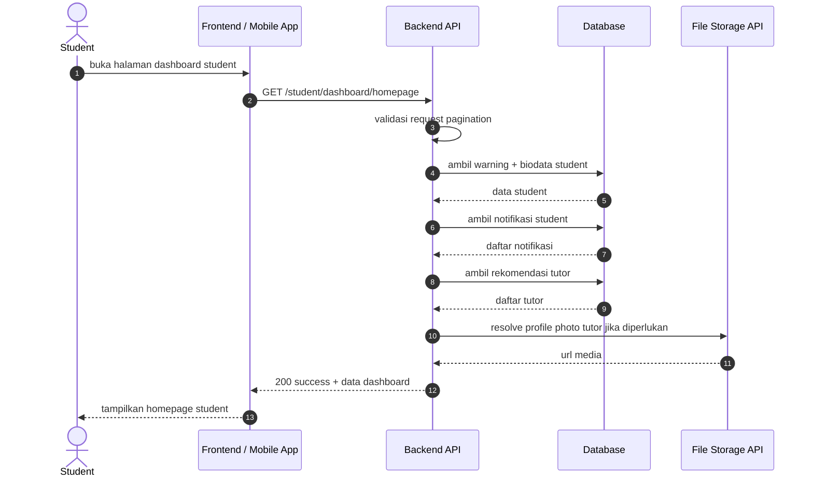
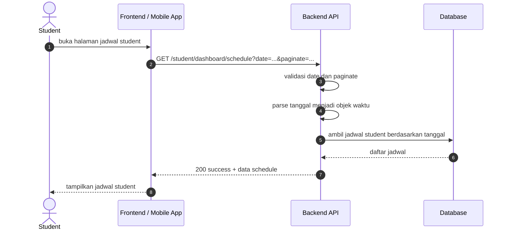
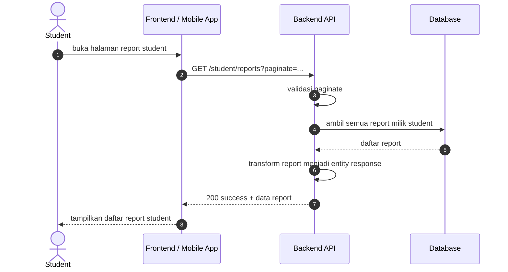

# Student Dashboard Sequence Diagrams

Dokumen ini merangkum alur dashboard untuk kategori student pada level tinggi agar mudah dipahami. Diagram disederhanakan menjadi interaksi utama antara client, backend, database, dan storage.

## 1. Student Homepage

## 2. Student Schedule Page

## 3. Student Reports

## Catatan

- Endpoint student dashboard berada di grup `role:student` pada [routes/api.php](../../routes/api.php).
- Endpoint report student berada di grup `role:student` pada [routes/api.php](../../routes/api.php).
- Flow homepage menampilkan warning, biodata student, notifikasi, dan rekomendasi tutor.
- Flow schedule menampilkan data jadwal berdasarkan tanggal yang dipilih.
- Flow reports menampilkan daftar report milik student.
