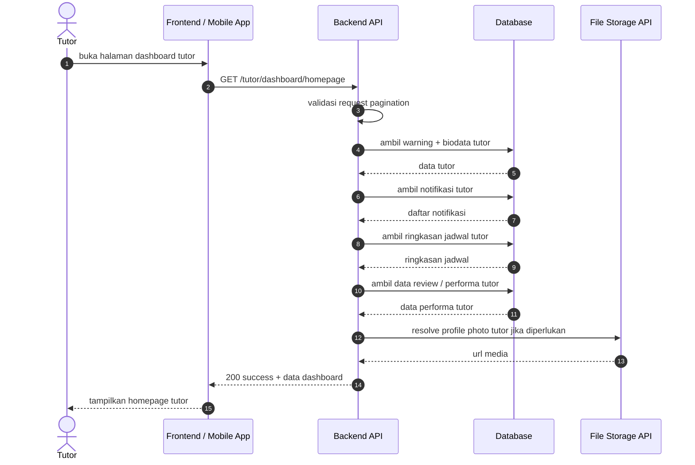
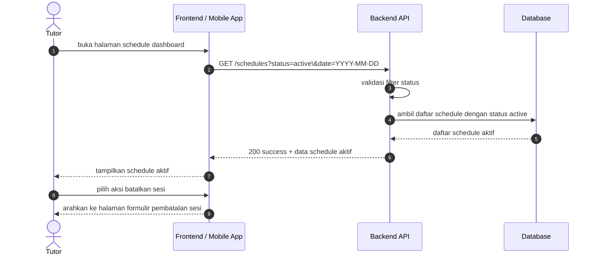
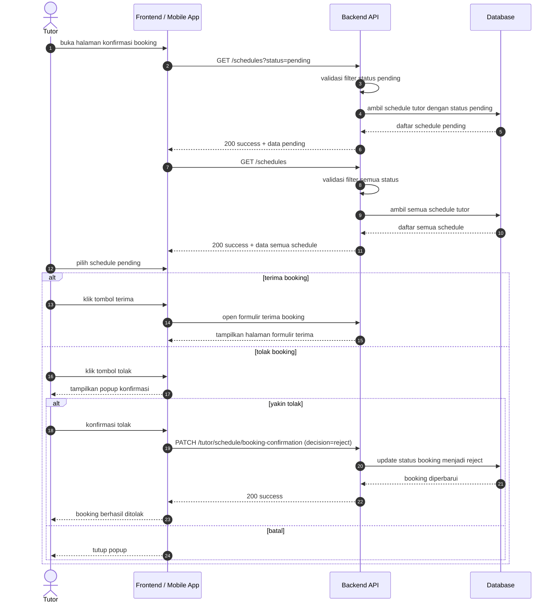
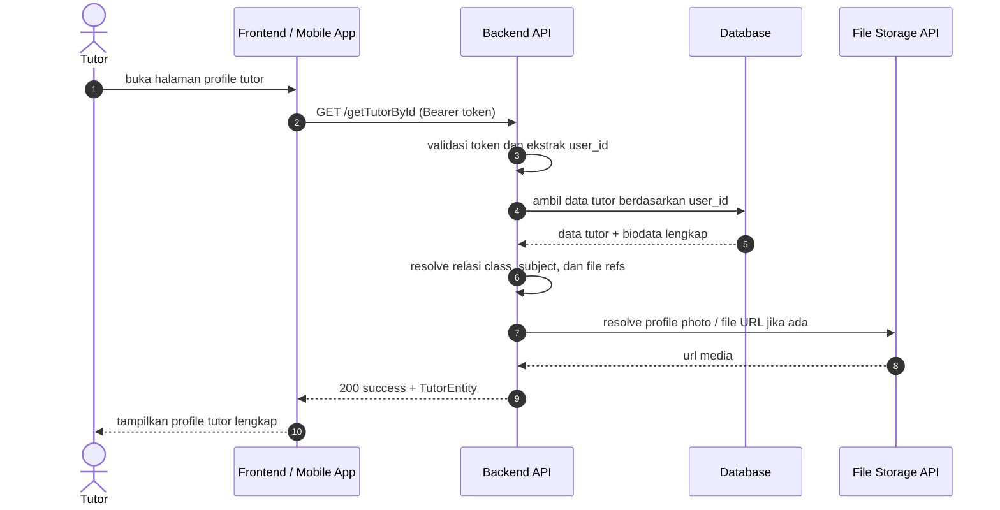

# Tutor Dashboard Sequence Diagrams

Dokumen ini merangkum alur dashboard untuk kategori tutor pada level tinggi agar mudah dipahami. Diagram disederhanakan menjadi interaksi utama antara client, backend, database, dan storage.

## 1. Tutor Homepage

## 2. Schedule Dashboard Page

## 3. Konfirmasi Booking Page

## 4. Profile Page

## Catatan

- Endpoint tutor dashboard homepage berada di grup `role:tutor` dan `verified.tutor` pada [routes/api.php](../../routes/api.php).
- Endpoint schedule dashboard dan konfirmasi booking berada di grup `role:tutor` pada [routes/api.php](../../routes/api.php).
- Endpoint profile tutor berada di grup `role:tutor` pada [routes/api.php](../../routes/api.php).
- Flow homepage menampilkan warning, biodata tutor, notifikasi, ringkasan jadwal, performa, dan media profil jika ada.
- Flow schedule menampilkan jadwal aktif saja.
- Flow konfirmasi booking menampilkan daftar pending dan semua status, lalu aksi terima/tolak untuk booking pending.
- Flow profile menampilkan biodata tutor lengkap beserta media profil jika ada.
