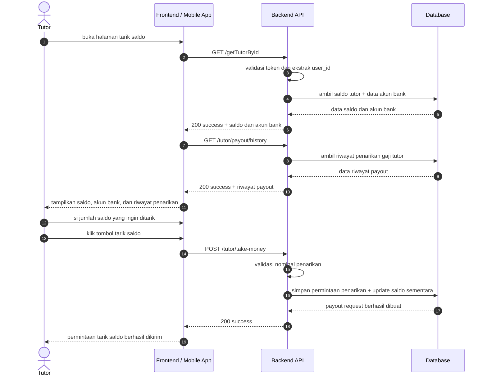

# Payout Sequence Diagrams

Dokumen ini merangkum alur payout pada level tinggi agar mudah dipahami. Diagram disederhanakan menjadi interaksi utama antara client, backend, dan database.

## 1. Halaman Tarik Saldo

## Catatan

- Endpoint data tutor untuk saldo dan akun bank menggunakan GET /getTutorById pada [routes/api.php](../../routes/api.php).
- Endpoint riwayat penarikan menggunakan GET /tutor/payout/history pada [routes/api.php](../../routes/api.php).
- Endpoint tarik saldo menggunakan POST /tutor/take-money pada [routes/api.php](../../routes/api.php).
