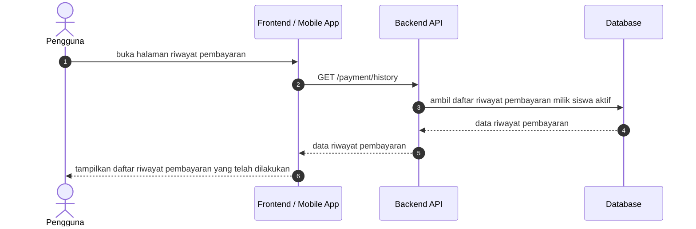

# Pembayaran Sequence Diagrams

Dokumen ini merangkum alur riwayat pembayaran pada level tinggi agar mudah dipahami. Diagram disederhanakan menjadi interaksi utama antara client, backend, dan database.

## 1. Halaman Daftar Riwayat Pembayaran

## Catatan

- Halaman riwayat pembayaran dapat diakses oleh role siswa.
- Halaman daftar riwayat pembayaran menggunakan endpoint [GET /payment/history](../../routes/api.php).
