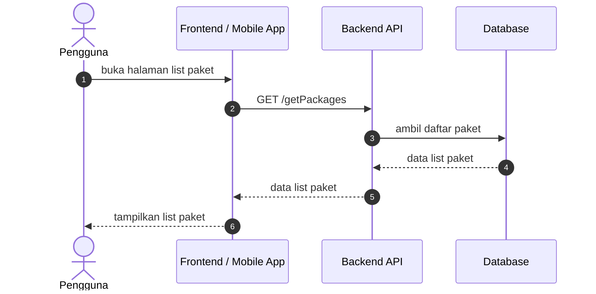
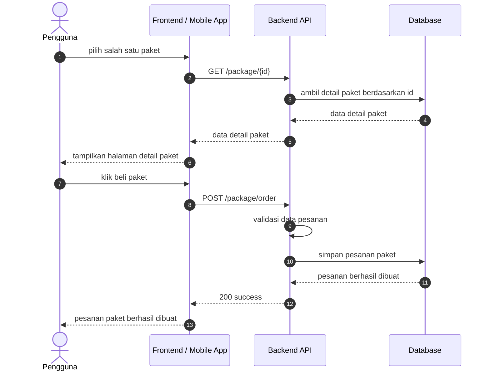
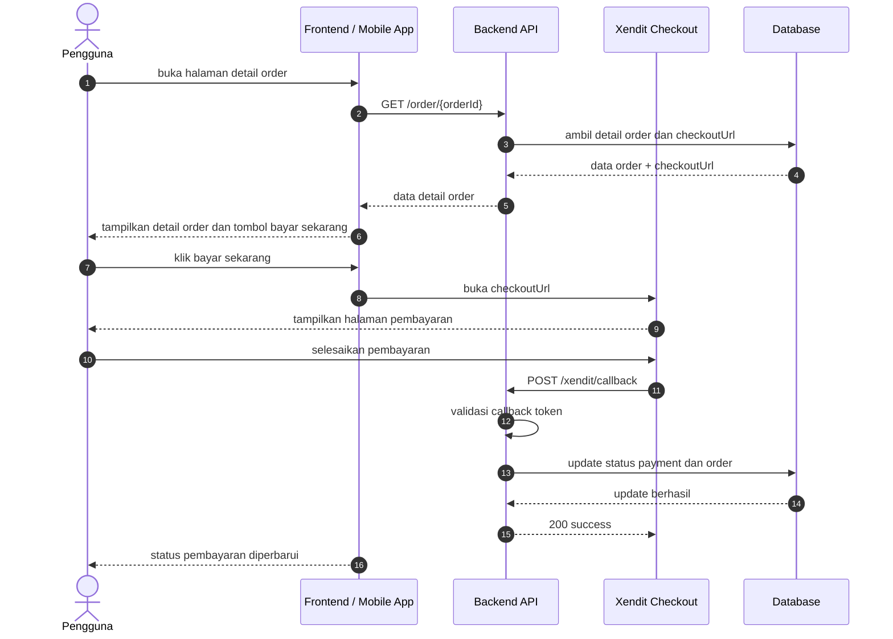

# Pembelian Paket Sequence Diagrams

Dokumen ini merangkum alur halaman paket pada level tinggi agar mudah dipahami. Diagram disederhanakan menjadi interaksi utama antara client, backend, dan database.

## 1. Halaman List Paket

## 2. Halaman Detail Paket

## Catatan

- Halaman list paket menggunakan endpoint [GET /getPackages](../../routes/api.php) yang ada di grup `auth:sanctum`.
- Halaman detail paket menggunakan endpoint [GET /package/{id}](../../routes/api.php) yang ada di grup `auth:sanctum`.
- Pembuatan pesanan paket menggunakan endpoint [POST /package/order](../../routes/api.php) yang ada di grup `auth:sanctum`.

## 3. Proses Pembayaran Order

## Catatan Pembayaran

- Halaman detail order menggunakan endpoint [GET /order/{orderId}](../../routes/api.php) yang ada di grup `auth:sanctum`.
- Redirect ke halaman pembayaran menggunakan `checkoutUrl` dari data order/pembayaran.
- Callback dari Xendit masuk ke endpoint [POST /xendit/callback](../../routes/api.php) yang dilindungi middleware `verify.xendit.callback.token`.
