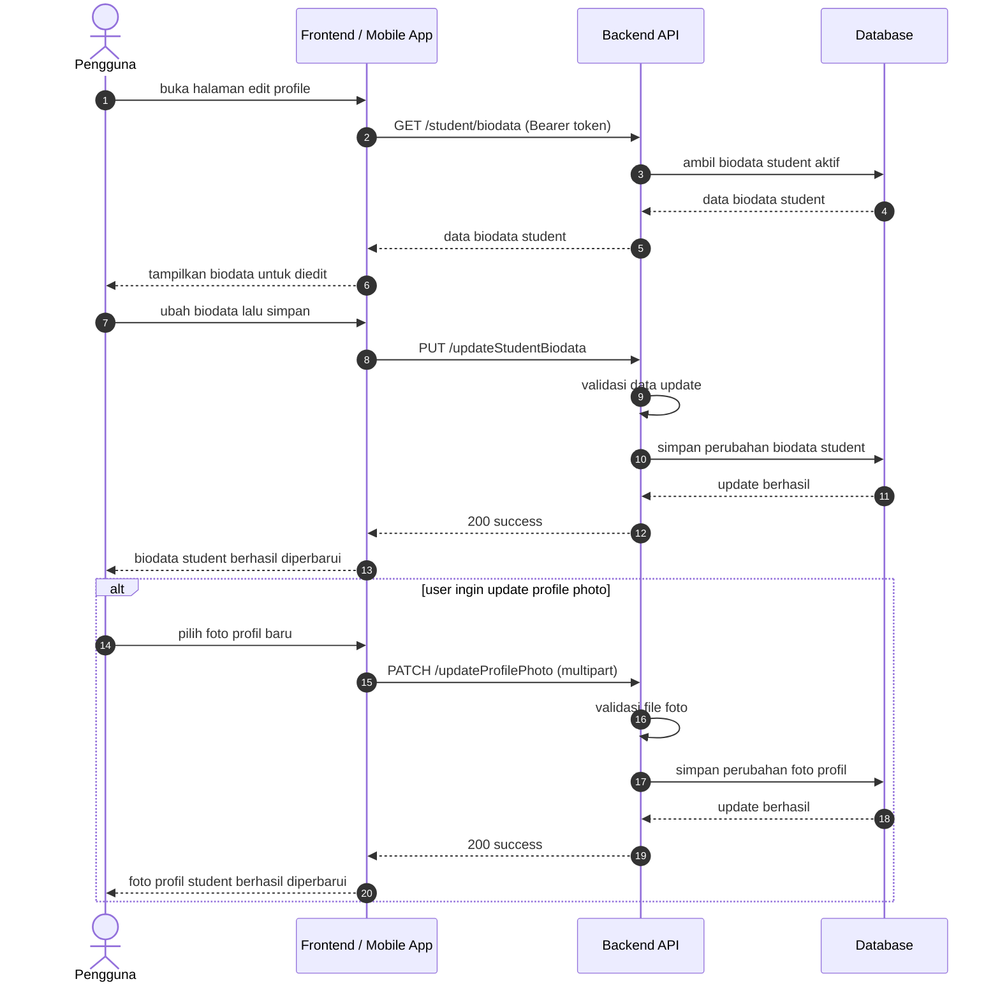
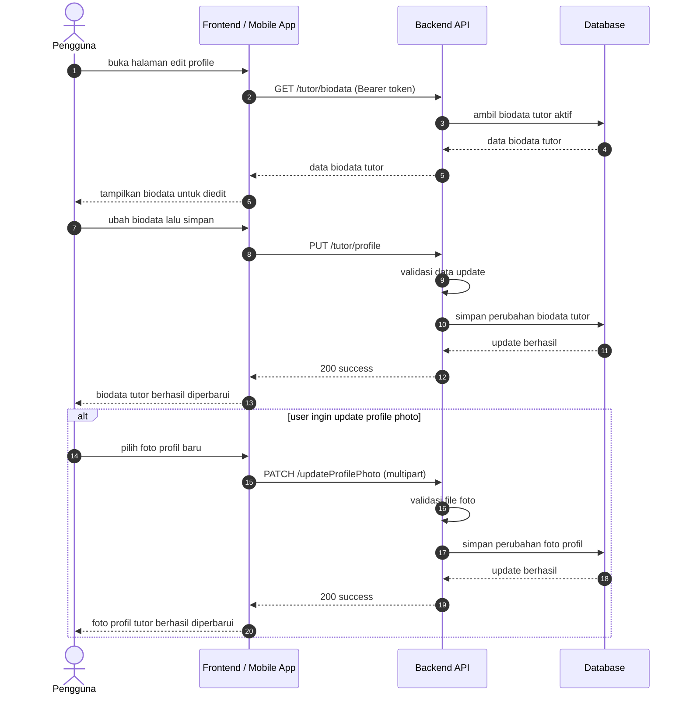

# Profile Sequence Diagrams

Dokumen ini merangkum alur edit profile pada level tinggi agar mudah dipahami. Diagram disederhanakan menjadi interaksi utama antara client, backend, dan database.

## 1. Edit Profile Student

## 2. Edit Profile Tutor

## Catatan

- Flow student dan tutor sama pada level tinggi, tetapi dipisahkan karena endpoint update dan pembacaan biodata berbeda.
- Endpoint update profile photo berada di grup `auth:sanctum` dan dipakai bersama oleh student maupun tutor.
- Endpoint profile yang dilindungi Sanctum berada di grup `auth:sanctum` pada [routes/api.php](../../routes/api.php).
