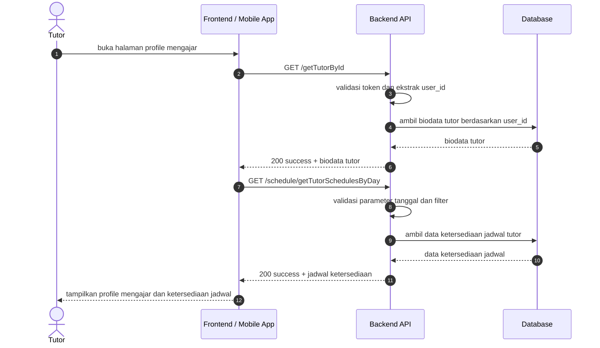
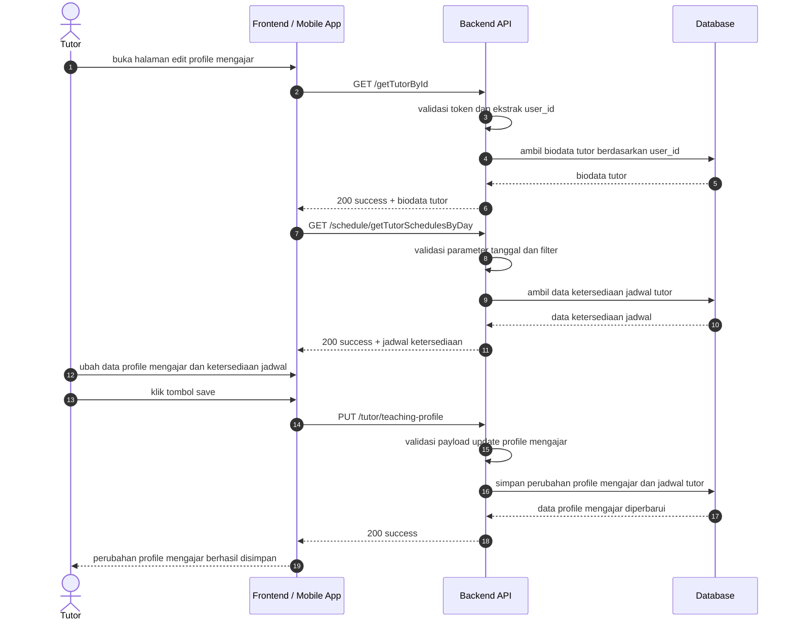

# Profile Mengajar Sequence Diagrams

Dokumen ini merangkum alur profile mengajar pada level tinggi agar mudah dipahami. Diagram disederhanakan menjadi interaksi utama antara client, backend, database, dan storage.

## 1. Halaman Profile Mengajar

## 2. Halaman Edit Profile Mengajar

## Catatan

- Endpoint biodata tutor berada di grup role:tutor pada [routes/api.php](../../routes/api.php).
- Endpoint jadwal tutor per hari berada di grup auth:sanctum pada [routes/api.php](../../routes/api.php).
- Endpoint update profile mengajar berada di grup role:tutor dan verified.tutor pada [routes/api.php](../../routes/api.php).
- Flow profile mengajar menampilkan biodata tutor dan data ketersediaan jadwal.
- Flow edit profile mengajar mengambil data awal yang sama, lalu menyimpan perubahan lewat endpoint update teaching profile.
