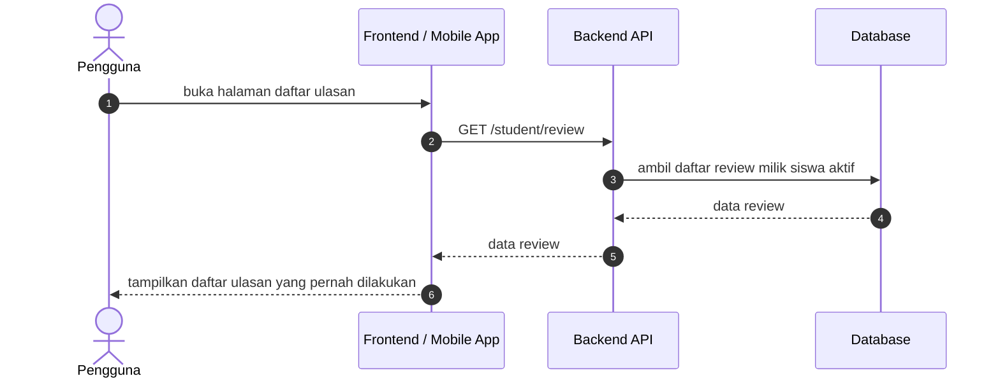

# Review Sequence Diagrams

Dokumen ini merangkum alur ulasan pada level tinggi agar mudah dipahami. Diagram disederhanakan menjadi interaksi utama antara client, backend, dan database.

## 1. Halaman Daftar Ulasan Milik Siswa

## Catatan

- Halaman daftar ulasan menggunakan endpoint [GET /student/review](../../routes/api.php).
