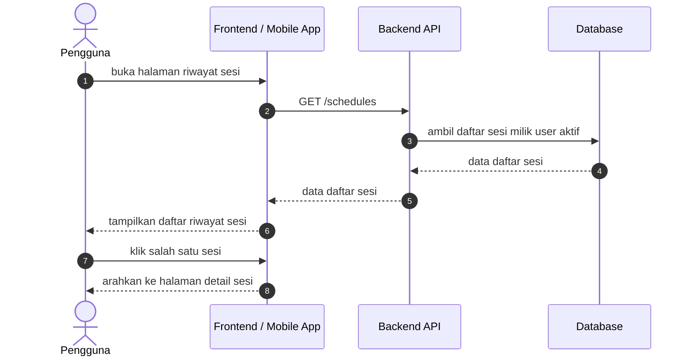
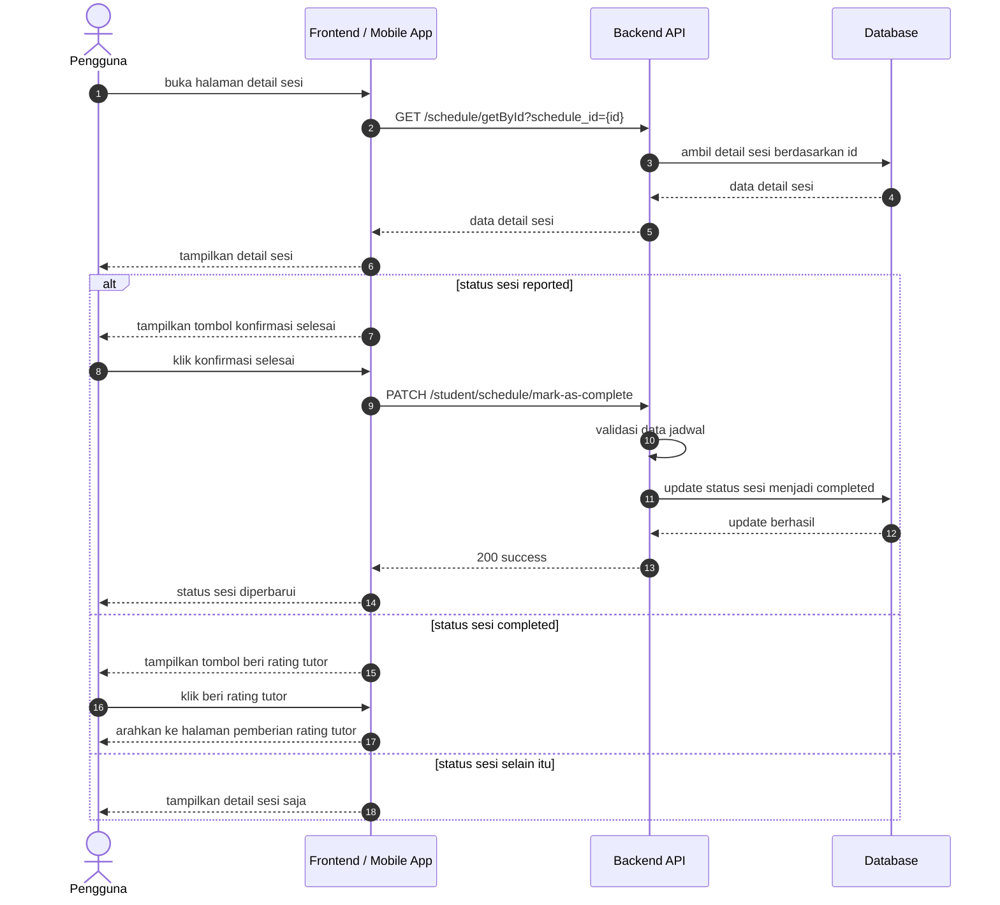
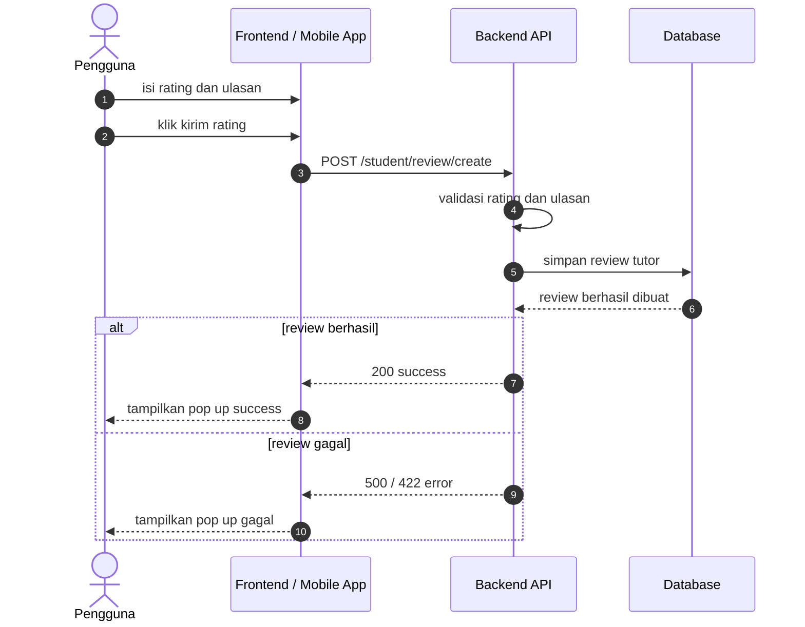

# Riwayat Sesi Sequence Diagrams

Dokumen ini merangkum alur riwayat sesi pada level tinggi agar mudah dipahami. Diagram disederhanakan menjadi interaksi utama antara client, backend, dan database.

## 1. Halaman Daftar Riwayat Sesi

## 2. Halaman Detail Sesi

## 3. Halaman Pemberian Rating Tutor

## Catatan

- Halaman daftar riwayat sesi menggunakan endpoint [GET /schedules](../../routes/api.php).
- Halaman detail sesi menggunakan endpoint [GET /schedule/getById](../../routes/api.php) dan alur lanjutannya bergantung pada status sesi.
- Halaman pemberian rating tutor menggunakan endpoint [POST /student/review/create](../../routes/api.php).
