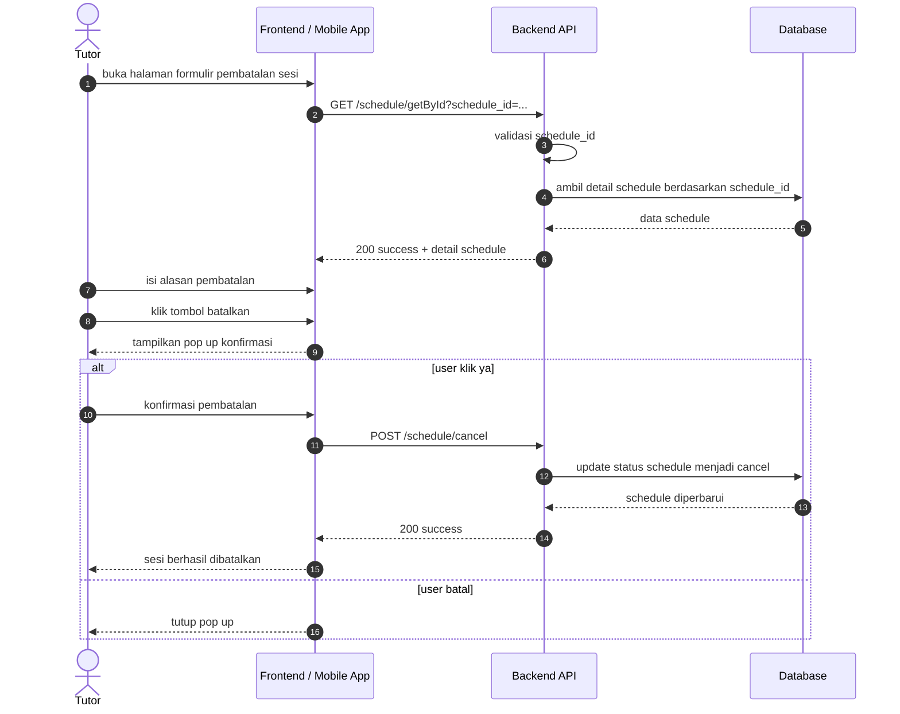
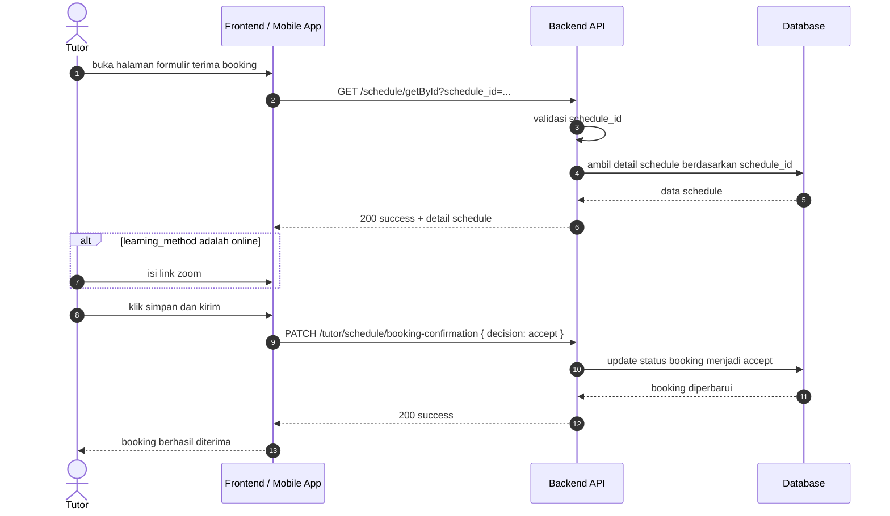
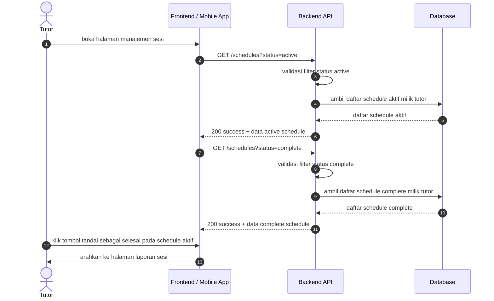
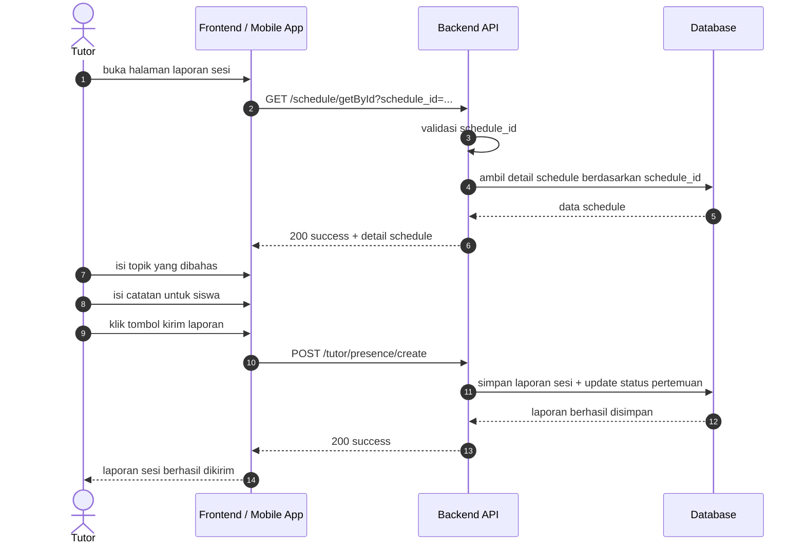
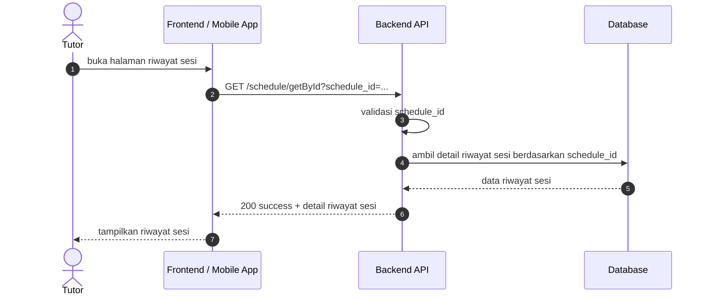

# Sesi Pembelajaran Sequence Diagrams

Dokumen ini merangkum alur sesi pembelajaran pada level tinggi agar mudah dipahami. Diagram disederhanakan menjadi interaksi utama antara client, backend, database, dan storage.

## 1. Pembatalan Sesi

## 2. Formulir Terima Booking

## 3. Halaman Manajemen Sesi

## 4. Halaman Laporan Sesi

## 5. Halaman Riwayat Sesi

## Catatan

- Endpoint detail schedule berada di grup `auth:sanctum` pada [routes/api.php](../../routes/api.php).
- Endpoint pembatalan sesi berada di grup `auth:sanctum` pada [routes/api.php](../../routes/api.php).
- Endpoint konfirmasi booking tutor berada di grup `role:tutor` pada [routes/api.php](../../routes/api.php).
- Endpoint manajemen sesi menggunakan endpoint schedule pada grup `auth:sanctum` di [routes/api.php](../../routes/api.php).
- Endpoint laporan sesi tutor berada di grup `role:tutor` dan `verified.tutor` pada [routes/api.php](../../routes/api.php).
- Flow pembatalan sesi menampilkan alasan pembatalan dan konfirmasi pop up sebelum cancel.
- Flow terima booking menampilkan detail schedule dan pengisian link zoom jika jadwal berlangsung online.
- Flow manajemen sesi menampilkan section schedule active dan complete, serta aksi tandai selesai.
- Flow laporan sesi menampilkan form topik dan catatan siswa, lalu submit laporan sesi.
- Flow riwayat sesi menampilkan detail sesi berdasarkan schedule_id.
